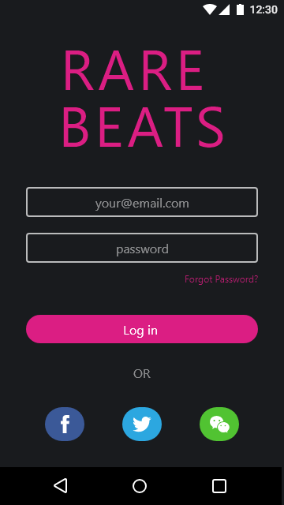
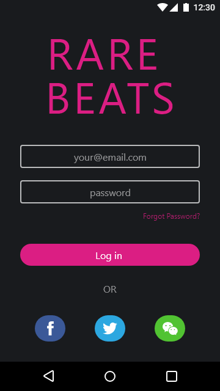
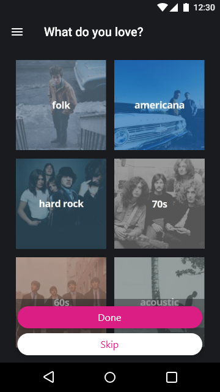
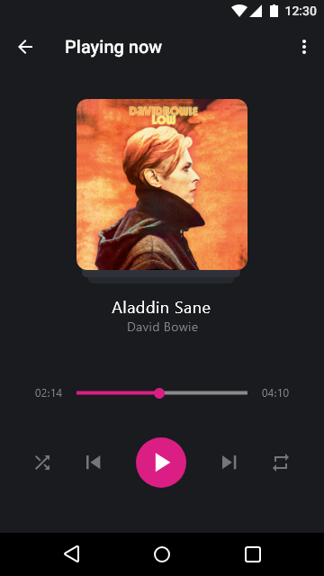

# ABND | MusicalStructureApp
This is a prototype for a music player application. 
It's the forth project completed for the Android Basics Nanodegree program offered by Udacity in collaboration with Google.

# Project Description
Create the design of a music application which allows the user listen to listen mainly to underrated music and artists.
In the most recent portion of the Nanodegree program, I learned how to think about the structure of an app and how to use OnClickListeners and explicit Intents to link between different activities within my own app. Practicing these skills will drastically improve the quality of the apps I build down the road.

  
 

# Pre-requisites
-	Android SDK v22
-	Android Build Tools v22.0.1
-	Android Support Repository v22.1.1

# Learning objectives
This project is about combining various ideas and skills we’ve been practicing throughout the course. They include:

- Designing an app experience to achieve a certain goal
- Creating new activities
- Using explicit Intents to link between activities in your app.
- Using OnClickListeners to add behavior to buttons using Java code.
